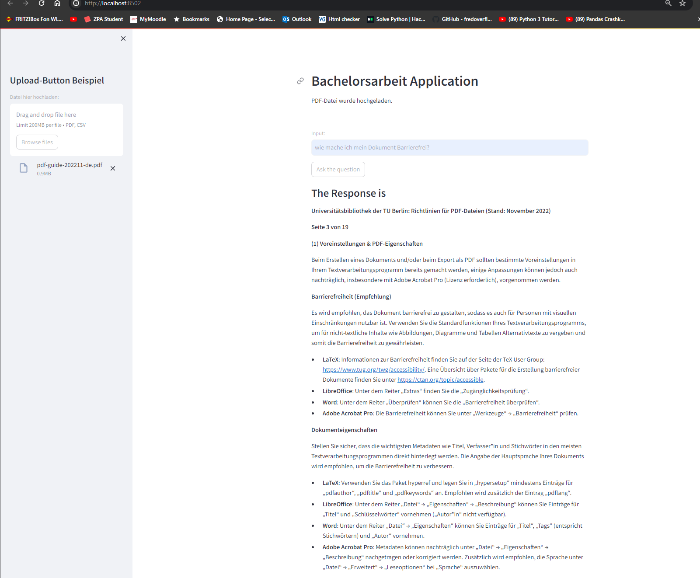

# Bachelorarbeit

## How to install

pip install -r requirements.txt

## Setup API key

Create file .env and add your OpenAI API key to it.

`OPENAI_API_KEY='YOUR_OPENAI_API_KEY_HERE'`

## Start Application

`streamlit run app.py`

## Beispiel

## Thank you
